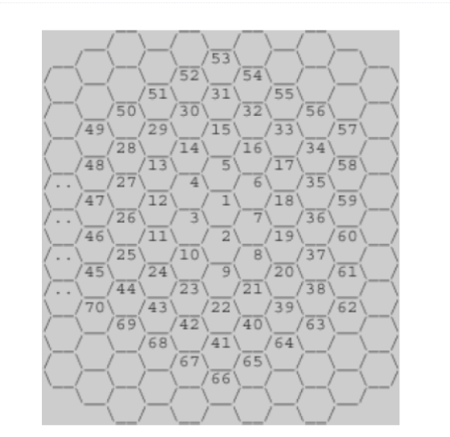

```c++
#include <vector>
using namespace std;

int main() {
	
	int num;
	int count = 0;
	cin >> num;
	int number = 1;
	for (int i = 0; i <= num; i++)
	{
		number += 6 * i;
		if (num == 1) 
		{
			count = 1; 
			break;
		}
		// 6 * n 수열 안에 포함되는가?
		if (number >= num) 
		{
			count = i + 1;
			break;
		}
	}
	
	cout << count << endl;
}
```
### [2292] 벌집
1. 수학적 개념이 필요하고 수열 구조의 이해가 핵심이다.
2. 그림의 1 -> 7 -> 19 수열의 반벅되는 특징을 찾아야 한다.
3. 해당 수열 구조로 몇번째 방 라인 인지를 판별해야 한다.